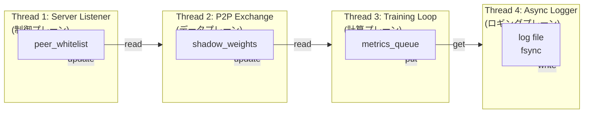
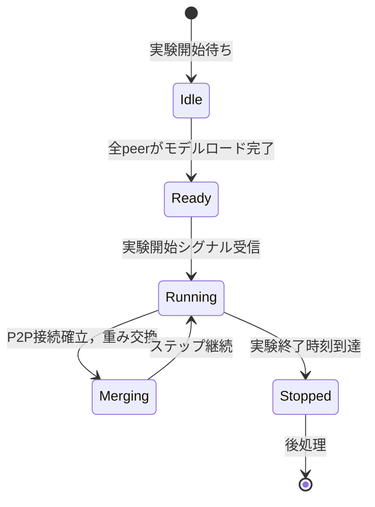
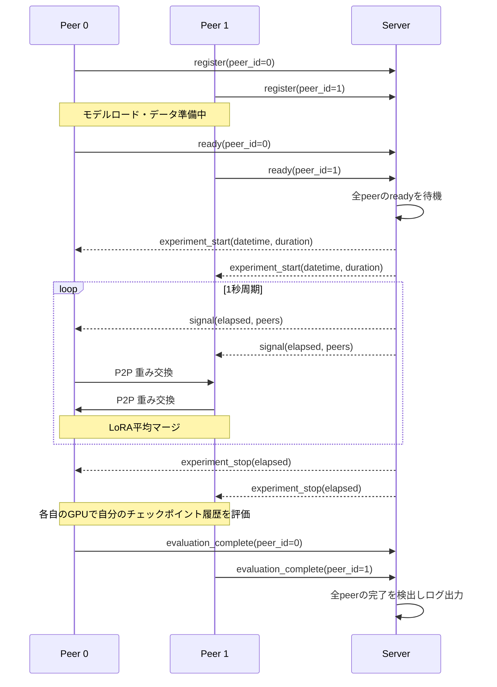
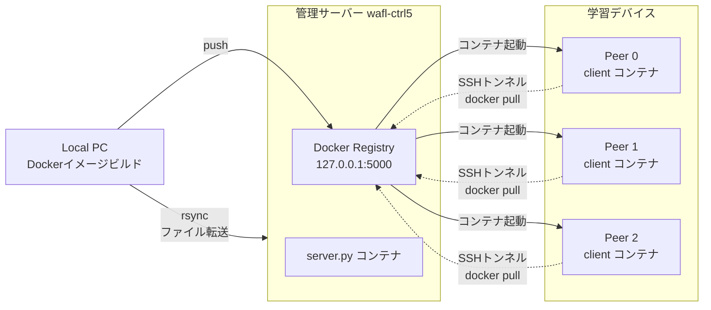

# WAFL-PEFT

WAFL-PEFT は，時変 P2P (Peer-to-Peer) トポロジー下でのフェデレーテッド PEFT (Parameter-Efficient Fine-Tuning) 実験フレームワークである．複数の学習デバイス (peer) が直接重みを交換しながら大規模言語モデルを LoRA で協調学習し，管理サーバーが動的な接触パターン (contact pattern) に応じて通信トポロジーを制御する．

本ファイルは**実装の入口**（アーキテクチャ・使用方法・設定・プロトコル・ログ形式）である．
実験の経緯と現在の到達点は `.claude/research/journal.md` の「現在の状態」節，
研究方針とその根拠は [docs/README.md](docs/README.md) から辿ること．
**過去の accuracy を引用する際の注意**: 2026-08-05（Iter14）に，outgoing 接続の受信処理が欠けていたため
**Iter1〜13 の全実験で P2P 重み交換が一度も成立していなかった**ことが判明した．詳細は
「設計上の重要な知見と修正」節を参照．

## 技術スタック

| 分野           | 技術                                             |
| -------------- | ------------------------------------------------ |
| フレームワーク | Python 3.10+, PyTorch, transformers, peft (LoRA) |
| データセット   | GSM8K (小学レベル数学文章題)                     |
| コンテナ       | Docker (CUDA 12.8 版 PyTorch，QLoRA 4-bit 量子化) |
| デプロイ       | SSH + rsync + Docker Registry (階層的配布)       |
| 環境管理       | uv (Python), mise (タスクランナー)               |

## 理論的背景

### フェデレーテッド学習

フェデレーテッド学習 (Federated Learning, FL) は，データプライバシーを維持しながら分散環境でモデルを訓練するパラダイムである．中央サーバーがモデルパラメータを配布し，各クライアントがローカルデータで訓練した後に重みを集約する (FedAvg: McMahan et al., 2017) ．

標準的な FL では，すべてのクライアントがサーバーに接続するスター型トポロジーが仮定される．しかしこれは以下の課題を抱える．

- **スケーラビリティ**: クライアント数が増えるとサーバーの通信ボトルネックが顕著になる
- **単一障害点**: サーバーが停止すると全体が停止する
- **ネットワーク制約**: リモート環境ではサーバーとの安定した接続が保証されない

WAFL-PEFT はこの制約を取り除くため，**P2P トポロジー** を採用する． peer は直接重みを交換し，管理サーバーはトポロジー制御のみを行う．

### パラメータ効率的ファインチューニング (PEFT)

大規模言語モデル (LLM) のファインチューニングには数十億のパラメータを更新する必要があり，各 peer が全パラメータを保存・送信するにはメモリと帯域の両面で現実的ではない．

LoRA (Low-Rank Adaptation: Hu et al., 2021) は，凍結された事前学習済みモデルの重み $W_0$ に対して，低ランク分解された更新 $\Delta W = BA$ を追加する．ここで $B \in \mathbb{R}^{d \times r}$, $A \in \mathbb{R}^{r \times k}$ であり，ランク $r \ll \min(d, k)$ である．

$$W_0x + \Delta Wx = W_0x + BAx$$

この方法により，更新対象パラメータが元のモデルの $0.01\%$ 以下に削減され，メモリと通信コストが劇的に減少する．本フレームワークでは，この LoRA パラメータのみを P2P 間で交換し，事前学習済み重みは各 peer がローカルに保持する．

### Non-IID データ分布の課題

現実の分散システムでは，各ノードが同じ確率分布からデータを取得するとは限らない．これを Non-IID (Non-Independent and Identically Distributed) 問題と呼ぶ．

本フレームワークでは， GSM8K の問題をカテゴリ (加減算，乗除算，百分率，平均，混合) に分類し，各 peer を特定のカテゴリに専門化させる．このとき，データは以下のように分散される．

- 70 〜 90%: 専門カテゴリの peer へ (確率的分配)
- 10 〜 30%: ランダム peer へ (マルチホップ用)

Non-IID 分布下では，各 peer のローカル訓練が異なる最適解に向かい，グローバルモデルの収束が不安定になる． P2P 重み交換と時変トポロジーは，この課題に対処するためのメカニズムである．

### 時変トポロジー

本フレームワークの核心概念である．固定トポロジーでは，接続されていない peer 間は知識が伝わらない．時変トポロジーでは，時間とともに通信ペアが変化する．

$t$ 時刻における peer $i$ の通信相手集合を $N_i(t)$ と表す． contact_pattern.json は，離散時刻 $t_1, t_2, \ldots$ における $N_i(t_j)$ を定義する．各接続の開始・終了は， start/end イベントとして明示的に定義される．

この設計により，すべての peer 対が最終的に通信する (グラフが時間的に連結) ，かつ，一度にすべての peer 対が通信するわけではないため，通信衝突を回避できる．

## アーキテクチャ

システム全体は管理サーバーと複数 peer で構成される．


### 4 層スレッドアーキテクチャ (クライアント)

各クライアントは 4 スレッドで並列動作する．この設計の目的は，**計算と通信の完全なオーバーラップ** を実現することである．

| Thread                    | 責務                                                                                    | データフロー     |
| ------------------------- | --------------------------------------------------------------------------------------- | ---------------- |
| Thread 1: Server Listener | 管理サーバーとの永続 TCP 接続．シグナル (ホワイトリスト，実験開始 / 終了) を受信        | 制御プレーン     |
| Thread 2: P2P Exchange    | ホワイトリストに基づき peer へ接続・失効時に切断， LoRA 重みを送受信・平均マージ計算 (model への反映は Thread 3 が行う) | データプレーン   |
| Thread 3: Training Loop   | LoRA パラメータの順伝播・逆伝播・ optimizer.step ．各ステップでメトリクスをキューへ投入 | 計算プレーン     |
| Thread 4: Async Logger    | メトリクスキューから読み取り，ファイルへ非同期書き出し (fsync 付き)                     | ロギングプレーン |

**評価はクライアント側では実験中に行わない**（重要な設計判断．詳細は「[設計上の重要な知見](#設計上の重要な知見と修正実験を通じて確立)」参照）．学習中モデルは `gradient_checkpointing` により `use_cache=False` であり， `model.generate()` による accuracy 評価は KV キャッシュが効かず極端に遅い（1 評価に 10 分以上）．これを訓練スレッドと同一プロセスで並行実行すると GPU/GIL を奪い合い訓練を巻き込むストールを起こすため，評価は次の 2 経路に分離した．

- **実験中**: 管理サーバー (`server.py` の GlobalEval スレッド) が全ノードの LoRA 重みを収集・平均マージし，専用 GPU でマージモデルのみを評価する．
- **実験終了後**: 各クライアントが訓練終了で空いた自分の GPU で，自分のチェックポイント履歴を評価する（`run_post_experiment_evaluation`）．5 台が並列に実行するため 1 台分の評価時間で全ノードの収束曲線が得られる．

スレッド間共有状態は `SharedState` クラスで管理され，ロックとキューで同期する．



#### スレッド同期の詳細

`SharedState` は以下の共有リソースを管理する．

| リソース                 | 型                  | 更新スレッド | 参照スレッド    | 同期機構                   |
| ------------------------ | ------------------- | ------------ | --------------- | -------------------------- |
| `peer_whitelist`         | `set[int]`          | Thread 1     | Thread 2        | `threading.Lock`           |
| `shadow_weights`         | `dict[str, Tensor]` | Thread 3     | Thread 2        | `threading.Lock`           |
| `shadow_version`         | `int`               | Thread 3     | Thread 2        | GIL (単純 int)             |
| `merge_queue`            | `queue.Queue`       | Thread 2     | Thread 3        | FIFO キュー (maxsize=32)   |
| `metrics_queue`          | `queue.Queue`       | Thread 3     | Thread 4        | FIFO キュー (maxsize=8192) |
| `current_step`           | `int`               | Thread 3     | Thread 2        | `threading.Lock`           |
| `experiment_running`     | `threading.Event`   | Thread 1     | Thread 3         | Event フラグ               |

`shadow_version` は Thread 3 が `shadow_weights` を更新（勾配累積境界ごと）するたびに +1 する版番号で， Thread 2 はこの変化時のみ重みをシリアライズ・送信する（後述の P2P 過剰シリアライズ修正）．

`peer_whitelist` は現在接触中の peer_id の集合を保持する． Thread 1 がサーバーから受信した `start`/`end` イベントに応じて要素を追加・削除し， Thread 2 がこの集合に基づいて TCP 接続を確立・切断することで，時変トポロジーのローテーションを実際の接続状態に反映する．接触の終了は，残り時間の推定によってではなく，必ずサーバーからの明示的な `end` イベントによってのみ判定される．

#### スループット平坦性 (Stall-Free Design)

伝統的なフェデレーテッド学習では，重み同期のたびに訓練が停止する (synchronize-and-wait) ．これによりスループットが周期性を持ち，時間とスループットの相関が強く現れる．

本フレームワークでは，以下の設計によりこれを回避する．

1. **非同期マージ**: P2P 交換スレッドは訓練ループとは独立に動作し，受信した重みの平均マージ計算のみを行って `merge_queue` に渡す．計算結果をモデル本体へ反映するのは常に訓練ループ (Thread 3) であり，`optimizer.step()` 完了直後のステップ境界でのみ行う．これにより，順伝播・逆伝播の実行中に別スレッドがモデルパラメータを書き換えるデータ競合を構造的に防ぐ
2. **シャドウコピー**: LoRA 重みのコピーを CPU 上に保持し， GPU 訓練とは独立に読み書きできる
3. **マージタイミングの分離**: マージ結果の反映は `current_step` の変化を検知して実行され，訓練ループはブロックされない

この結果，通信中でも計算は継続し，スループットと時間の相関係数は ~0 に近づく．

## 設計上の重要な知見と修正（実験を通じて確立）

本フレームワークは実機（RTX 3060 12GB × 10 ノード + 管理サーバー，`google/gemma-4-E2B` を 4-bit QLoRA）での
反復実験を通じて，いくつかの重要な設計判断とバグ修正を確立してきた．ここに横断的な知見を集約する．
個別の詳細は上記・下記の各節に対応している．
実際に使うノードは `config/hosts.txt` の行数で決まり，2026-08-05 時点では 10 台（`192.168.15.100`〜`.109`）である．
Iter1〜11 の実験は 5 台構成で行われたため，当時の数値と直接は比較できない（1 ノードあたりのシャードが半減する）．

### 学習効率（各ノードの性能を着実に向上させるための工夫）

- **勾配累積（`grad_accum_steps`）**: `max_seq_len` × 巨大 vocab（262144）の logits メモリ制約により，
  真のバッチ拡大（batch>1）は OOM しやすい．そこで micro-batch=1 のまま N ステップ勾配を貯めて 1 回更新し，
  メモリ安全なまま実効バッチを拡大する．単一サンプルの極めてノイジーな勾配が学習を非効率にしていた問題を，
  メモリを増やさずに緩和できる（4 と 8 で有意差はなかった）．
- **エポックごとのデータシャッフル**: 以前は `step % len(train_data)` の逐次巡回で毎エポック同じ順序を見ており，
  過学習を助長していた．全データ 1 周ごとに順序をシャッフルする．
- **LR warmup + 時間ベース cosine 減衰（gentle）**: `lr_warmup_steps` 回かけて線形に立ち上げた後，
  実験の経過時間割合（`elapsed/duration`）で cosine 減衰する（総ステップ数が事前に定まらない時間ベース制御
  でも各ノードが終盤で同様に LR を下げられる）．減衰の強さは反復実験で調整し，**`lr_min_ratio=0.5`
  （終盤に base の 50% まで緩やかに減衰）が最良**だった：高速ノード（外部競合が軽く多ステップ回るノード）の
  終盤過学習を緩め，マージモデルの accuracy も改善した．一方 `0.1`（終盤に 10% まで急減衰）は未収束のまま
  更新を弱め逆効果，`1.0`（減衰なし定数）も高速ノードが過学習気味だった．
- **過学習抑制の正則化**: LoRA dropout を `0.05→0.15` に上げ，`lr_min_ratio=0.5` と併せて小シャード
  （約 1345 サンプル）での過学習を抑える．**容量（LoRA rank）は増やすと逆効果**：rank16→32 は peak は同等
  でも last が大きく低下し（過学習悪化）、accuracy 平均は 22.5%→16.2% に悪化した．小モデル + 難タスク +
  小シャードの領域では rank16 で容量は足り，増やすと暗記に向かう．
- **truncation で消えるサンプルの除外**: `max_seq_len` を下げると長い解答の末尾（`#### N`）が切れ，
  ラベルが全マスク（損失 0・勾配 0）の無駄ステップになる．tokenize 時にこうした例を除外する．
- **Non-IID シャードの均等化**（前述）: 小シャードの過学習を抑え，各ノードの学習データ量を底上げする．
- 以上により，ノード別 GSM8K accuracy の平均改善は改善前の +6pt から **+14pt**（最終平均 ~22%）へ向上した．

### 評価の設計（accuracy を正しく・安定して測る）

- **採点バグの修正**: 当初の accuracy 採点は (1) 生成文にプロンプト（質問文）が含まれたままの部分文字列マッチ，
  (2) `max_new_tokens=32` で CoT が `#### N` に到達する前に打ち切り，の 2 つの欠陥で学習と無相関だった
  （あるノードは全期間 accuracy が完全に固定だった）．**生成トークンのみをデコード**し，`max_new_tokens=256`，
  `#### N` の数値を**厳密一致**で採点するよう修正した（`src/gsm8k_eval.py`）．
- **評価を学習と別ハードウェアに分離**: 学習中モデルは `gradient_checkpointing` で `use_cache=False` のため
  `model.generate()` が極端に遅く訓練を巻き込む．さらに評価は学習ノードの VRAM を消費し外部 GPU 競合下では
  OOM を招く．そこで評価は次の 2 経路に分離した．
  - **実験中のマージモデル収束**: 管理サーバーが全ノードの LoRA を rsync 収集・平均マージし専用 GPU で評価
    → `results/<exp>/global_eval.log`．
  - **各 peer の checkpoint 別 accuracy**: `config/hosts.eval.txt` の**評価専用ホスト**で `src/eval_worker.py` が
    担当 peer の checkpoint を rsync で随時取得して評価し，サーバーへ送信 → `results/<exp>/device_eval.log`．
    学習ノードは実験終了時に `.training_done` マーカーを書くだけ（`WAFL_SELF_EVAL=0`）．評価ホストが使えない
    環境では学習ノード自身が実験後に自己評価する経路（`WAFL_SELF_EVAL=1`、既定）にフォールバックできる．
- **評価のコストとノイズ**: 生成は逐次的で重く，40 サンプルでもノイズは ±5〜7pt．学習成果を明確に示すには
  サンプル数を増やす（時間とのトレードオフ．生成バッチ拡大は eval 時 KV キャッシュで OOM リスクのため
  逐次のサンプル数増で対応）．

### 安定性・正確性・VRAM のバグ修正

- **VRAM 削減で外部競合下の OOM を解消**: 他ユーザーの GPU ジョブが 1.3→2.6GB へ増大し，我々のピーク
  （~9.5GB）と合わせて 12GB を超え全ノードが OOM する事態が発生した．ピーク自体を下げるため
  **(1) optimizer を paged 8-bit AdamW（`bnb.optim.PagedAdamW8bit`）に**（8-bit 化 + 逼迫時に CPU へ
  ページング），**(2) chunked cross-entropy**（262144 vocab の logits を fp32 で全 materialize せず
  トークン方向に分割して損失計算。`src/client.py` の `_memory_efficient_causal_lm_loss`。ForCausalLMLoss と
  同一値），**(3) `max_seq_len=208`**，**(4) `PYTORCH_CUDA_ALLOC_CONF=expandable_segments:True`** を導入し，
  ピークを ~8.85GB へ下げて外部競合 2.5GB 下でも安定稼働させた．
- **P2P 過剰シリアライズの解消**: Thread 2 の送信条件が「マージが起きるまで毎ループ」で 48MB の LoRA 重みを
  `torch.save` で再シリアライズし続け GIL を保持し，Thread 3 を数秒ブロックしていた（step 0.7s↔7s）．
  **版番号（`shadow_version`）が進んだ時だけ送信**するスロットルで解消．
- **受信バッファの最新版のみ保持**: peer ごとに全受信版を溜めてマージ時に一括 deserialize していたため
  数十秒ストール + 多く送った peer の過大重みが生じた．**peer ごとに最新 1 つだけ保持**して解消（各 peer 1 票）．
- **完了通知の取りこぼし（idle ベース grace へ）**: 完了通知の受付を「実験終了からの固定時間」で打ち切っていたが，
  評価が重くなるたび（900→2400s と延ばしても）遅いノードの通知が締切後に届いて失われた（TCP backlog により
  クライアントの送信は成功するため気づきにくい）．**「最後の評価活動からの無応答時間」で判定する idle ベース**
  （`_POST_EXPERIMENT_EVAL_IDLE_GRACE_SECONDS`）に変え，順次完了している限り待ち続け，本当にハングした
  ノードだけを長い沈黙で検出する．諦める際は欠落 peer をログ出力する．
- **ロガーの早期終了バグ**: Thread 4 が `state.running=False` で自発終了すると実験後評価の結果を取りこぼす．
  `None` センチネル受信でのみ終了するよう修正．
- **P2P 重み交換が成立していなかった問題（2026-08-05 修正．最も影響が大きい）**: 同一 peer との通信は
  双方が別方向へ connect する 2 本の TCP 接続で成立する設計だったが，**outgoing 側の接続に受信処理が無く**，
  相手からの重みは着信接続経由でしか `receive_buffers` に入らなかった．着信が成立しない環境では
  `receive_buffers` が常に空のままマージ条件が偽になり続け，**Iter1〜13 の全実験で重み交換が一度も
  起きていなかった**（接触イベント自体は正常に発生していたため気づきにくい）．
  outgoing 接続にも `_recv_peer_info()` と受信ループを追加して解消した．
  併せて，peer_id の受信と重みデータの受信を別スレッドへ分けてデッドロックを解消し
  （`_receive_weights_loop`），接触終了直後の peer のバッファもマージ対象に含めるよう
  `prev_whitelist` でフィルタするようにした．
- **マージに自ノードの重みを含める（W3，2026-08-05 採用）**: 従来は受信した remote peer のみを平均し，
  その結果でローカル重みを `param.copy_()` で完全上書きしていた．接触相手が 1 台のとき（RWP のペア接触では
  通常こうなる）これは平均ではなく**相手の重みへの置換**であり，直前のマージ以降の自ノードの学習が
  すべて破棄されていた（WAFL 原典 Eq.3 は自ノードを含む平均を規定している）．
  自ノードの重みを加えて `count += 1` する実装に変更し，環境変数 `WAFL_MERGE_INCLUDE_SELF`（既定 `1`）で
  切り替えられるようにした．10 ノードでの対比では最終 loss が 0.517 → 0.364，per-peer の最終 loss の
  標準偏差が 0.406 → 0.171 となった（`merged` は CPU 上・`param` は CUDA 上にあるため，加算前に
  `.to(param.device)` が必要である点に注意）．

### 運用・可観測性

- **ログの経過時間 prefix + tab 整列**: prefix を実時刻でなく実験開始からの経過秒数にし，フィールドを
  tab 区切り・スレッドタグ固定幅で整列（本文の重複した経過時間表記は削除）．
- **分析の自己完結化**: レポートは本文（目的・設定・指標定義・結果・解釈）を先に，グラフを末尾に 1 画像 1 グラフで
  集約．`analyze.py` は GPU 不使用でログを読むだけなので学習用 GPU が塞がっていても分析できる．
- **実験フォルダの命名**: `experiment.experiment_name` を `IterX` のように実験ごとに設定し，
  `results/IterX_<timestamp>` で識別しやすくする．
- **外部 GPU 競合への配慮**: ノードの GPU を他ユーザーが共有し，これが OOM・step 遅延（マージ時のメモリ逼迫で
  一時的に compute が遅くなる。P2P stall ではなく外部要因由来）の主因になる．上記の VRAM 削減で共存性を確保する．
- **マージイベントの JSONL 化（2026-08-05）**: マージの発生は `print()` で標準出力にしか出ておらず，
  `collect_logs.py` が JSONL メトリクスファイルのみを回収するため事後に数えられなかった（Docker の
  標準出力は回収対象外）．`type: "merge"` のレコードをメトリクスへ書き出すようにし，発生数・時刻・
  相手 peer 数・自ノードを含めたかを検証できるようにした．**マージが起きたか分からない状態で
  accuracy を解釈してはならない**という教訓による（実際に Iter1〜13 は 0 回だった）．

### 到達点（学習最適化の収束）— **2026-07-26 に判定を保留**

> **この節の結論は保留中である．** 評価問題数が 40〜80 問しかなく，accuracy p≈0.225 における
> 80% power の最小検出可能差が 18.5〜26.2pt だったのに対し，当時の成功条件は「+2pt 以上」であった．
> したがって以下の「有意差なし／悪化」といった判定の大半は測定ノイズの範囲内であり，
> 統計的には成立していない（`plans/p0001_research_direction_2026-07.md` F1，
> `.claude/research/backlog.md` の B3）．
>
> さらに 2026-08-05（Iter14）に，**outgoing 接続に受信ロジックが無く `receive_buffers` が常に空だった**
> ため，**Iter1〜13 の全実験で P2P 重み交換が一度も成立していなかった**ことが判明した
> （commit `96d4716` / `077368a` / `182f46b` で修正）．以下の accuracy 系列は「協調学習の効果」ではなく
> 各ノードの孤立学習の結果として読む必要がある．
>
> 記録として当時の内容をそのまま残すが，再利用する際は必ず上記 2 点を添えること．
> 現在の到達点は `.claude/research/journal.md` の「現在の状態」節を参照する．

反復実験（Iter1〜11，5 ノード構成）の結果，固定制約（VRAM／contact pattern／モデルを固定）下での学習最適化は上限に収束した（と当時判定した）．

- **最良構成**: `lora_rank=16 / lora_alpha=32 / lr 2e-4 / lr_min_ratio=0.5 / lora_dropout=0.15 /
  grad_accum_steps=8 / max_seq_len=208` + chunked CE + paged 8-bit AdamW．
- **結果**: ノード別 GSM8K accuracy は最終 ~22%（改善 +14pt），全 5 ノードが着実に向上．マージモデルは
  ピーク ~25%．
- **上限の性質**: 学習ウィンドウ延長（過学習）・過剰な LR 減衰・容量増（rank32，過学習）はいずれも逆効果で，
  dropout や gentle 減衰の微調整は測定ノイズ（±5pt）内だった．~22% の上限は容量不足ではなく
  **小モデル（gemma-4-E2B）+ 難タスク（GSM8K）+ 小シャード（~1345 サンプル）**による過学習限界であり，
  現行の固定条件下で単一レバーでは超えられない．さらなる向上には，より大きいベースモデル・データ量・
  contact pattern 等の固定条件の見直しが必要である．

## プロジェクト構成

```mermaid
graph LR
    subgraph cfg["config/"]
        S["settings.json<br/>実験設定・contact_pattern_file指定"]
        H["hosts.txt<br/>学習ノードIPリスト"]
        HE["hosts.eval.txt<br/>評価専用ホストIPリスト（行順=担当peer_id）"]
    end

    subgraph src["src/"]
        SV["server.py<br/>管理サーバー"]
        CL["client.py<br/>学習クライアント"]
        EW["eval_worker.py<br/>評価専用ホストの随時評価ワーカー"]
        SD["setup_data.py<br/>データ準備"]
        GC["generate_contact_pattern.py<br/>接触パターン生成"]
        AN["analyze.py<br/>単一実験の分析・可視化"]
        CR["compare_runs.py<br/>反復実験の集計（平均±標準偏差）"]
        CB["compare_baselines.py<br/>ベースラインとの比較"]
        GEV["gsm8k_eval.py<br/>GSM8K評価ロジック共通モジュール"]
        DD["deploy_distribute.py<br/>デプロイ（eval 引数で評価ホストにも配布）"]
        SG["setup_gpu_nodes.py<br/>各ノードへGPUツールキット導入"]
        SC["start_clients.py<br/>学習クライアント並列起動"]
        SE["start_eval_workers.py<br/>評価ワーカー起動"]
        CLG["collect_logs.py<br/>ログ回収"]
        CN["clean.py<br/>クリーンアップ"]
        UT["utils.py<br/>共通関数"]
        LG["log.py<br/>ログ整形"]
    end

    subgraph data["data/"]
        TR["train/ peer_X.json"]
        TE["test/ peer_X.json"]
        CP["contact_pattern/<br/>時変トポロジーJSON"]
    end

    subgraph rec["記録（コード外）"]
        DOC["docs/<br/>調査・設計・論文原稿（索引は docs/README.md）"]
        PL["plans/<br/>研究方針・大規模変更の計画"]
        RS[".claude/research/<br/>research-cycle の journal / backlog / config"]
    end

    cfg --> src
    src --> data
    src -.->|結果の解釈| rec
```



各ディレクトリの役割は次のとおりである．`results/`・`data/`・`cache/` は `.gitignore` 対象であり，
リポジトリには含まれない．

| ディレクトリ | 役割 |
| --- | --- |
| `config/` | 実験設定（`settings.json`）とノード一覧（`hosts.txt` / `hosts.eval.txt`） |
| `src/` | サーバー・クライアント・デプロイ・分析のスクリプト |
| `data/` | Non-IID 分割済みデータと接触パターン（`mise run setup` が生成） |
| `results/` | 実験ごとの `logs/` と `output/`（分析レポート・図） |
| `cache/` | モデル・データセットのダウンロードキャッシュ |
| `docs/` | 文献調査・位置付けの調査記録，論文原稿．索引は [docs/README.md](docs/README.md) |
| `plans/` | 研究方針の意思決定（`p0001_research_direction_2026-07.md`） |
| `.claude/research/` | research-cycle の一次記録（`journal.md` / `backlog.md` / `config.yml` / `state.json`） |

## 時変トポロジー (contact_pattern.json)

`data/contact_pattern/` 配下の JSON ファイルで，時間経過に伴う P2P 接触の開始・終了を定義する．どのファイルを使うかは `config/settings.json` の `experiment.contact_pattern_file` にファイル名で指定する．キーは実験開始からの経過秒数，値はその時刻に発生したイベントのリストである．各イベントは `{"event": "start"|"end", "peers": [i, j]}` の形式で，`peers` は接触が変化する2つの peer_id を昇順で表す．

```jsonc
{
  "60": [
    { "event": "start", "peers": [0, 1] }
  ],
  "90": [
    { "event": "end", "peers": [0, 1] },
    { "event": "start", "peers": [1, 2] }
  ]
}
```

この例では， t=60s で peer 0-1 間の接触が開始し， t=90s で peer 0-1 間の接触が終了すると同時に peer 1-2 間の接触が新たに開始する．

管理サーバー (`server.py`) は，実験開始からの経過時間に応じて，まだ配信していない新規イベントのみを毎秒クライアントへ配信する．各クライアント (`client.py`) は，自身の peer_id が含まれるイベントを受信するたびに， `start` であれば相手 peer をホワイトリストへ追加し， `end` であればホワイトリストから除去する．接触の終了は必ずサーバーからの明示的な `end` イベントによって制御され，接続時間を事前に見積もる仕組みは持たない．

### contact_pattern.json の生成

`src/generate_contact_pattern.py` は， Random Waypoint Mobility (RWP) モデルに従ってノードを移動させ，無線到達距離内に入った区間を接触イベントへ変換して出力する．ノード数は `config/hosts.txt` の行数から自動決定される．

```bash
uv run python src/generate_contact_pattern.py \
  --n-time 5000 --min-speed 1.0 --max-speed 5.0 \
  --radio-range 100 --area-size 500 --pose-time 10 --seed 42

# または mise 経由（引数は "--" の後に渡す）
mise run setup:contact-pattern -- --n-time 5000 --seed 42
```

| オプション | 意味 | デフォルト |
| --- | --- | --- |
| `--n-time` | シミュレーション総ステップ数（=総秒数） | 5000 |
| `--min-speed` / `--max-speed` | 移動速度の範囲 | 1.0 / 5.0 |
| `--radio-range` | 無線到達距離 | 100 |
| `--area-size` | 正方形エリアの一辺 | 500 |
| `--pose-time` | ウェイポイント到達後の静止時間 | 10 |
| `--seed` | 乱数シード | 42 |
| `--animation` | ノード移動の GIF アニメーションも生成する | 無効 |

出力先は `data/contact_pattern/` 固定であり，ファイル名はパラメータを含む形式 (`rwp_n{ノード数}_a{エリアサイズ}_r{到達距離}_p{静止時間}_s{シード}.json`) になる．生成物を確認した上で，`config/settings.json` の `experiment.contact_pattern_file` にそのファイル名を設定すると `server.py` の起動時に読み込まれる．

### トポロジーのグラフ理論的性質

時変トポロジーは，時間とともに変化するグラフ $G(t) = (V, E(t))$ として定式化できる．ここで $V$ は peer の集合， $E(t)$ は t 時刻の辺の集合である．

本フレームワークが目指す性質は，**時間的連結性 (temporal connectivity)** である．すなわち，任意の peer 対 $(i, j)$ に対して，時間区間 $[0, T]$ の中に $i$ から $j$ への時間依存パスが存在すること．



## GSM8K Non-IID データシャード

`setup_data.py` は GSM8K データセットを peer 固有のシャードに分割する．各 peer が特定のカテゴリ (加減算，乗除算，百分率，平均，混合) に偏ったデータを持つ Non-IID 分布を生成する．

### カテゴリ分類ロジック

問題テキスト内の正規表現キーワードに基づき，最も一致数の多いカテゴリに分類する．

| カテゴリ     | キーワード例                                                                     |
| ------------ | -------------------------------------------------------------------------------- |
| `add_sub`    | total, more, less, left, added, sum, increase, decrease, difference, plus, minus |
| `mul_div`    | times, product, multipl, each, split, divide, per, rate, x\d+                    |
| `percentage` | \d+%, percent, discount, interest, tax                                           |
| `average`    | average, mean, median, per capita                                                |
| `mixed`      | 上記いずれにも該当しない                                                         |

### データ分配アルゴリズム

```
1. GSM8K データセットをシャッフル後，train/test に分割 (設定比率，デフォルト 90/10)
2. 訓練データ各サンプルにカテゴリラベルを付与 (classify_problem関数)
3. カテゴリごとにサンプルをシャッフル
4. peer_id i にカテゴリ categories[i % num_categories] を割り当て
5. 各サンプルを以下のように分配:
   - 確率 p = 0.7 + 0.2 * U(0,1) で専門 peer へ
   - それ以外: ランダム peer へ (マルチホップ用)
6. 均等化リバランス（後述）で全 peer をほぼ同数へ揃える
7. テストデータは peer_id = idx % num_peers で均等分配
```

#### 均等化リバランス（過学習の抑制）

手順 5 までのカテゴリ主導の分配では，カテゴリのサイズ差がそのまま peer のシャードサイズ差になり，
実測で peer あたり 335〜2606 サンプルと**極端に不均衡**になっていた．小さいシャード（335 件）を持つ peer は
26 分の実験で同じ少数データを 8 周ほど繰り返し，過学習に陥りやすい．

そこで手順 6 で，全 peer を `target = 総数 / peer数`（現構成で 6725 / 5 = **1345**）へ揃える
リバランスを行う（`setup_data.py`）．

- target を超える peer からは，**非 specialty サンプルを優先的に**プールへ移す（Non-IID 特性の核である
  specialty サンプルを可能な限り残す）．
- target に満たない peer をプールから補充する．
- サンプルの重複・欠落は起こさない（**disjoint 分割を維持**）．

この結果，大カテゴリ（add_sub 等）の peer は specialty 集中を保ちつつ，小カテゴリ（average, percentage）の
peer もデータ量が 4 倍程度に底上げされ，過学習が緩和される．各 peer は自分の専門カテゴリを主に持ちつつ
他カテゴリも一部持つため， P2P 交換を通じて他カテゴリの知識も獲得できる．

## 通信プロトコル

### 共通フォーマット

すべてのメッセージは以下のフレーム構造を持つ．

```
+------------------+-------------------+
| Length (4 bytes) | Payload (variable)|
|  (big-endian)    |   (JSON or binary)|
+------------------+-------------------+
```

Length は big-endian 4 バイト符号なし整数． JSON ペイロードは 10MB まで受信する．バイナリペイロードは 100MB まで受信する．

### 管理サーバー <-> クライアント (制御プレーン)

TCP 接続， JSON ボディのフォーマット． `type` フィールドでメッセージ種別を区別する．

| メッセージ              | 方向            | 内容                                                               |
| ----------------------- | --------------- | ------------------------------------------------------------------ |
| `register`              | Client → Server | `{"type": "register", "peer_id": int}`                             |
| `ready`                 | Client → Server | `{"type": "ready", "peer_id": int}`                                |
| `signal`                | Server → Client | `{"type": "signal", "elapsed": float, "events": [{"event":"start"/"end","peers":[i,j]}]}` |
| `experiment_start`      | Server → Client | `{"type": "experiment_start", "datetime": str, "duration": float}` |
| `experiment_stop`       | Server → Client | `{"type": "experiment_stop", "elapsed": float}`                    |
| `evaluation_complete`   | Client → Server | `{"type": "evaluation_complete", "peer_id": int}`（実験終了後，各クライアントが自分の実験後評価を完了した時に送信．サーバーは全 peer 分を受信して「全デバイスの実験・評価完了」を検出・ログ出力する） |

### P2P 重み交換 (データプレーン)

TCP 接続，以下の順序で送信する．

```
1. peer_id フレーム: 4 バイト長さ + JSON ({"peer_id": int})
2. 重みフレーム (複数可能): 4 バイト長さ + pickle (gzip 圧縮なし)
```

重みデータは LoRA パラメータの state_dict であり，以下の手順で送信用に変換する．

1. 訓練時は数値安定性のため float32 で保持している各テンソルを float16 へダウンキャスト（通信量を約半分に削減．実測で 410 テンソル・約 96.6MB → 約 48MB）
2. `torch.save(state_dict, buffer)` で pickle シリアライズ

gzip 圧縮は行わない．ニューラルネットの重みは乱数に近い分布のため圧縮率が低く（float32・96MB の実測で圧縮後 88.6MB と 8% 程度の削減），圧縮・解凍自体に数秒（実測: 圧縮 6.3 秒，解凍 1.1 秒）かかる．この間 Thread 3 (訓練ループ) との GIL 競合でスループットが周期的に停止するストールを引き起こすため，圧縮による通信量削減よりも計算のブロッキングを避けることを優先する．

**送信のスロットル（版番号ベース）**: シリアライズ（`torch.save`）は CPU で GIL を保持するため，頻繁に行うと
Thread 3 の順伝播・逆伝播を断続的にブロックする．そこで Thread 2 は `shadow_version` の変化時（＝重みが実際に
更新された勾配累積境界ごと）かつ送信先がある時だけシリアライズ・送信する．これにより送信回数が重みの更新頻度に
一致し，無駄な再シリアライズが消える（詳細は「[設計上の重要な知見](#設計上の重要な知見と修正実験を通じて確立)」）．

**受信は peer ごとに最新の 1 つだけ保持**する．受信バッファを peer_id → 最新バイト列の辞書として上書きし，
マージ時に peer あたり 1 回だけ deserialize する．これは (1) 新接触時に溜まった多数の版を一括 deserialize して
数十秒ブロックする性能問題，(2) 多く送信した peer が平均で過大重みになる正確性バグ，の両方を同時に解消する．

受信した重みを平均マージする．平均マージは単純算術平均であり，受信した $K$ peer の重み $w_i$（各 peer 1 票）を
以下で統合する．

$$w_{\text{merged}} = \frac{1}{K} \sum_{i=1}^{K} w_i$$

計算結果は `merge_queue` を介して Thread 3 に渡され，Thread 3 が `optimizer.step()` 完了直後（勾配累積境界）に
モデルへ反映する（マージ計算中にパラメータが書き換わるデータ競合を構造的に防ぐ）．

### 実験ライフサイクル



実験の終了は学習ステップ数の上限ではなく，時間のみで制御される．管理サーバーは `contact_pattern.json` のタイムライン上で最後に発生するイベント時刻に固定バッファ (60秒) を加えた時刻を `experiment_duration` として算出し，この時間が経過すると全クライアントへ `experiment_stop` を送信する．クライアントは訓練データを何周でも回し続けながら学習を継続し，`experiment_stop` を受信するまで停止しない．そのため接触パターンの総時間を変更すれば，学習ステップ数の設定を変えることなく実験時間を調整できる．

`experiment_stop` 受信後，各クライアントは訓練を止めて GPU を解放し，自分のチェックポイント履歴を評価してから
`evaluation_complete` をサーバーへ送る．サーバーは全 peer 分の完了通知を受け取ると
「`All N/N devices have finished the experiment and evaluation.`」をログ出力する．応答のないクライアントのために
猶予期間（`_POST_EXPERIMENT_EVAL_GRACE_SECONDS`，40 分）を設け，超過時はそれ以上待たずに受付を終える．

## 設定 (settings.json)

```jsonc
{
  "model": {
    "model_id": "google/gemma-4-E2B"       // 学習対象モデル
  },
  "training": {
    "learning_rate": 2e-4,                  // AdamW学習率（実効バッチ拡大に合わせて調整）
    "batch_size": 1,                        // micro-batchサイズ（勾配累積の1回分）
    "grad_accum_steps": 8,                  // 勾配累積回数（実効バッチ = batch_size × これ）
    "lr_warmup_steps": 20,                  // LR線形warmupのoptimizerステップ数
    "lr_min_ratio": 0.5,                    // cosine減衰の下限比（0.5=終盤にbaseの50%まで緩やか減衰。反復実験で最良）
    "max_seq_len": 208,                     // 最大シーケンス長（vocab 262144 で logits メモリが大。外部GPU競合下でVRAMに収めるため208。VRAM削減=chunked CE + paged optimizer と併用）
    "lora_rank": 16,                        // LoRAランク（32へ増やすと小シャードで過学習し逆効果。16が最適）
    "lora_alpha": 32,                       // LoRAアルファ
    "eval_interval_seconds": 60             // チェックポイント保存の間隔（秒）
  },
  "data": {
    "validation_split": 0.1,                // 訓練/テスト分割比率
    "seed": 42                              // 乱数シード
  },
  "communication": {
    "client_p2p_port": 8888                 // P2P通信ポート
  },
  "server": {
    "server_host": "wafl-ctrl5",            // 管理サーバーホスト
    "server_ip": "192.168.15.10",           // 管理サーバーIP
    "server_port": 9999,                    // 管理サーバーポート
    "ufw_allow_from": "192.168.15.0/24"
  },
  "deployment": {
    "ssh_user": "denjo",                    // SSHユーザー
    "deploy_dir": "/home/denjo/workspace/ktakahashi/WAFL-PEFT"
  },
  "experiment": {
    "experiment_name": "Iter12_best",        // 実験名（IterX 等にすると results/<name>_<timestamp> で識別しやすい）
    "contact_pattern_file": "rwp_n05_a0500_r100_p10_s42.json"  // 使用する接触パターンJSON
  },
  "global_eval": {
    "interval_seconds": 120,                // サーバーのマージモデル評価間隔（秒）
    "sample_limit": 40                      // マージモデル評価に用いるGSM8K検証サンプル数
  }
}
```

学習効率に関わる `learning_rate` / `grad_accum_steps` / `lr_warmup_steps` / `lr_min_ratio` / `max_seq_len` の
設計判断と実験的な根拠は「[設計上の重要な知見](#設計上の重要な知見と修正実験を通じて確立)」にまとめている．

### LoRA パラメータの詳細

`lora_rank` と `lora_alpha` は LoRA の内部次元とスケーリング係数を指定する． LoRA の実際の更新は以下のように計算される．

$$\Delta W = \frac{\alpha}{r} BA$$

ここで $\frac{\alpha}{r}$ はスケーリング係数であり，デフォルトでは $\frac{32}{16} = 2.0$ である． rank が小さいほどパラメータ数が削減されるが，表現力が低下する． alpha は rank に対する相対的な重みを調整する．

target_modules は正規表現で指定され，以下のモジュールが対象となる．

```
self_attn.q_proj, self_attn.k_proj, self_attn.v_proj, self_attn.o_proj
mlp.gate_proj, mlp.up_proj, mlp.down_proj
```

## 環境変数（アルゴリズムの切り替え）

`settings.json` に置くと実験ごとの書き換えが必要になる「条件の切り替え」は，環境変数で行う．
`mise run start:clients`（または `mise run start`）の実行時に指定すると，
`src/start_clients.py` が `docker run -e ...` として各学習ノードのコンテナへ転送する．
比較実験では **1 つだけ変える**（単一レバー原則）．

| 環境変数 | 既定 | 意味 |
| --- | --- | --- |
| `WAFL_P2P_ENABLED` | `1` | `0` で P2P 重み交換を無効化する．孤立学習（self-training）ベースラインを取るときに使う |
| `WAFL_MERGE_INCLUDE_SELF` | `1` | `1` でマージの平均に自ノードの重みを含める（WAFL 原典 Eq.3 準拠）．`0` は含めない従来の挙動で，接触相手 1 台のときは相手の重みへの置換になる．メトリクスの `merge_includes_self` にそのまま出る |
| `WAFL_P2P_SYNC` | `0` | `1` で同期バリア方式（訓練ループ内で重み交換の完了を待つ逐次方式）にする．`0` は非同期（ストールフリー）経路 |
| `WAFL_P2P_SYNC_TIMEOUT_SEC` | 未指定 | 同期バリアのタイムアウト秒．未指定なら `settings.json` の `communication.p2p_sync_timeout_sec`（既定 15.0）を使う |
| `WAFL_SELF_EVAL` | `1` | `0` で学習ノードの実験後自己評価を無効化する．評価専用ホスト（`eval_worker.py`）へ評価を委譲する構成で使う |

```bash
# 例: マージに自ノードを含めない条件で実験する（control 側）
WAFL_MERGE_INCLUDE_SELF=0 mise run start

# 例: 孤立学習ベースライン
WAFL_P2P_ENABLED=0 mise run start
```

## 使用方法

### 1. 環境セットアップ

```bash
# すべて (モデル・データ・Dockerイメージ)
mise run setup

# または個別に実行
mise run setup:model             # HuggingFaceベースモデルをローカルキャッシュへダウンロード
mise run setup:data              # GSM8KをNon-IIDシャードとして生成
mise run setup:build             # Dockerイメージビルド

# 接触パターンの生成（任意，パラメータ変更時のみ実行。setup全体には含まれない）
# --n-time は総秒数＝学習ウィンドウ長。現行は 1500（RNG 決定性により長時間版の先頭区間は短時間版と一致）
mise run setup:contact-pattern -- --n-time 1500 --seed 42
```

### 2. デプロイ

```bash
# すべて (ローカル → 管理サーバー → 各学習デバイス)
mise run deploy

# 個別フェーズ
mise run deploy:sync-local    # 管理サーバーへファイル転送
mise run deploy:registry      # 管理サーバーのレジストリへイメージpush
mise run deploy:distribute    # 各学習デバイスへイメージ配布・コンテナ起動

# 評価専用ホストを使う場合（任意。学習ノードの VRAM を評価で圧迫しないハード分離）
mise run deploy:eval          # hosts.eval.txt の各ホストへ registry pull で image 配布 + モデル/データセット同期
```

デプロイフローは以下の 3 層階層である．



### 3. 実験実行

```bash
# すべて (サーバー + 全クライアント起動)
mise run start

# 個別
mise run start:server    # 管理サーバーコンテナ起動（グローバル収束性能のリアルタイム評価スレッドを含む）
mise run start:clients   # 全学習デバイスコンテナ並列起動

# 評価専用ホストを使う場合（deploy:eval 実行後）。各評価ホストで eval_worker を起動し、
# 学習中から担当 peer の checkpoint を随時評価する。学習クライアント側は WAFL_SELF_EVAL=0 で自己評価を無効化する
mise run start:eval
```

評価ホストを使わない構成では，学習クライアントが実験終了後に自 GPU で自己評価する（既定 `WAFL_SELF_EVAL=1`）。
評価ホストの provisioning は image(~15G on-disk)+model(9.6G) の disk を要するため，各評価ホストに ~25G 以上の
空きが必要である（不足ノードでは `deploy:eval` の registry pull が失敗する）。

### 4. 分析

```bash
# すべて (ログ回収 + 評価)
mise run analyze

# 個別
mise run analyze:collect     # 各デバイスからメトリクス・LoRA重みを回収
mise run analyze:evaluate    # マージ・グラフ生成・レポート作成
```

### 5. クリーンアップ

```bash
mise run clean
```

ローカル (cache/, .venv/, data/) ，管理サーバー，全学習デバイス上の Docker コンテナ・イメージ・デプロイディレクトリを削除する．

## グローバルモデルのリアルタイム監視 (server.py の GlobalEval スレッド)

`mise run analyze` は実験終了後にしか収束性能を評価できないため，学習中に
フェデレーテッド学習全体としての収束傾向を追跡できるよう，`server.py` は
実験管理と並行して GlobalEval スレッド（`_global_eval_thread`）を実行する．
`config/settings.json` の `global_eval.interval_seconds`（デフォルト 120 秒）
ごとに以下を行う．

1. 各学習デバイスから最新の LoRA 重みチェックポイントを SSH + rsync で収集
2. 収集した中で最新のステップ番号のチェックポイントを全 peer 間で平均マージ
3. GSM8K バリデーションセット（`global_eval.sample_limit` 件，デフォルト 40）で
   マージ後のグローバルモデルの accuracy を評価
4. 結果を `results/{experiment_name}_{timestamp}/global_eval.log` に
   JSON Lines 形式（`{"step": int, "timestamp": str, "accuracy": float, "num_devices": int}`）で追記

学習用の GPU（各学習デバイス）とは別に，管理サーバー自身の GPU を使うため，学習スループットへの影響がない．
そのため `start:server` タスクのコンテナ起動には `--gpus all` と各学習デバイスへ接続するための SSH 鍵の
読み取り専用マウント（`-v /home/{ssh_user}/.ssh:/home/{ssh_user}/.ssh:ro`）が追加されている．

実験中はマージモデルのみを評価する（デバイス個別の評価も同じラウンドで行うと，学習デバイス数に比例して
1 ラウンドが伸び，短い実験時間内に十分な数のラウンドを回せなくなるため）．**デバイス個別の収束曲線は，
実験終了後に各学習デバイス自身が空いた自分の GPU で評価する**（下記「評価 6」）．これにより 5 台が並列に実行され，
1 台分の評価時間で全ノードの結果が得られる．

## 実験結果分析 (analyze.py)

評価（accuracy 算出）は `analyze.py` 自身では行わない．accuracy を生成評価するには GPU が要り時間もかかるため，
評価は実験の実行系（サーバー・各デバイス）に埋め込んで済ませ，**`analyze.py` は GPU を使わずログを読んで作図・
集計するだけ**にしている．具体的には，マージモデルの収束（評価 5）はサーバーが実験中に記録した
`global_eval.log` を，デバイス個別の収束（評価 6）は各デバイスが実験終了後に記録したメトリクスログの
`"type": "eval"` レコードを読む．

生成物は「本文（実験の目的・設定・各指標の定義・結果・解釈）を先に，グラフ画像を末尾にまとめる」構成の
自己完結した Markdown レポート `results/{experiment_name}_{timestamp}/output/analysis_report.md` と，
**1 画像 1 グラフ**の PNG 群である．

| 図 | 内容 |
| --- | --- |
| 評価 1 (fig01) | **スループットの平坦性**．各 peer の Token/s（薄線）と時間ビン平均（赤線）．経過時間との相関係数 \|r\|<0.1 が stall-free の指標． |
| 評価 1b (fig01b) | **累積トークン数**の推移．傾きがスループット，直線的なら安定した学習進行を示す． |
| 評価 2 (fig02) | 各 peer の**訓練損失**の推移とビン平均． |
| 評価 3 (fig04) | **損失 vs スループット散布図**（peer 別に色分け）． |
| 評価 5 (fig03) | **全ノード平均マージモデルの accuracy 収束**（サーバーが実験中に記録）． |
| 評価 6 (fig06) | **各ノード単体モデルの accuracy 推移**（各デバイスが実験終了後に自己評価）．「各ノードの性能が着実に向上したか」を直接示す中心の図． |

accuracy 採点は `gsm8k_eval.py` の `score_generations` に集約されており，サーバー・各デバイスで共通条件で行う．
`Question: {question}\nAnswer:` を入力に最大 256 トークンを greedy 生成し，**生成トークンのみをデコード**して
`#### N` の数値を正規化し，gold と**厳密一致**したものを正解とする（採点の落とし穴は後述の知見を参照）．
環境変数 `ANALYZE_CONVERGENCE=0` で評価 5・6 の作図をスキップできる．

**実験間の比較**には別のスクリプトを使う．

| スクリプト | 用途 |
| --- | --- |
| `src/compare_runs.py` | 同一条件の反復実験を集計する（平均 ± 標準偏差）．research-cycle の `metrics_cmd` に登録されている |
| `src/compare_baselines.py` | 孤立学習（`WAFL_P2P_ENABLED=0`）などのベースラインとの比較 |

**accuracy や loss を解釈する前に，マージが実際に起きたかを必ず先に確認する**こと．
メトリクスの `"type": "merge"` レコードを数える（例:
`grep -c '"type": "merge"' results/<実験名>/logs/peer_*/metrics_peer_*_final.log`）．
0 件であれば，その実験は孤立学習であり協調学習の結果として読めない．

## Docker コンテナ構成

各コンテナは以下のボリュームをマウントする．

| マウント元 | マウント先  | 用途                                |
| ---------- | ----------- | ----------------------------------- |
| ./src      | /app/src    | ソースコード                        |
| ./config   | /app/config | 設定ファイル                        |
| ./data     | /app/data   | 訓練・テストデータ                  |
| ./cache    | /app/cache  | モデルキャッシュ (クライアントのみ) |
| ./logs     | /app/logs   | メトリクスログ，チェックポイント    |

管理サーバー・学習デバイスの両方が `--net=host` モードで起動する．学習デバイス側の P2P 用ポート（`client_p2p_port`）はこのモードでなければホストに公開されず，他 peer から一切接続できなくなるため必須である．学習デバイスは加えて `--add-host {server_host}:{server_ip}` で管理サーバーの IP を追加設定する．

### Dockerfile のビルド順序

Dockerfile はビルドレイヤーの最適化を考慮している．変更頻度の低い層を先にビルドし，キャッシュを最大化する．

1. システム依存 (curl, rsync, openssh-client) — ほぼ不変
2. uv インストール — 不変
3. ユーザー作成 — 不変
4. pyproject.toml コピー + 依存関係インストール（`--mount=type=cache` でuv/pipの
   ダウンロードキャッシュを永続化．レイヤー1のようなシステム依存を変更して
   これより上流のレイヤーキャッシュが無効になった場合でも，torch 等の
   巨大パッケージ（合計10GB超）の再ダウンロードを避けられる）— 稀に変更
5. 仮想環境 (.venv) の chown — この時点では src/・config/ がまだCOPYされて
   いないため，chown -R の対象が .venv のみに確定する
6. ソースコードコピー（`COPY --chown` で直接所有権を指定）— 頻繁に変更．
   レイヤー5を分離しているため，ソース変更のみのリビルドで
   chown -R の再実行（.venv 全体，数百秒）が発生しない
7. Docker 設定 (insecure-registries) — 不変

## ネットワークポート

| ポート | 用途                           | 開放先                            |
| ------ | ------------------------------ | --------------------------------- |
| 9999   | 管理サーバー <-> クライアント  | `ufw_allow_from`（例 192.168.15.0/24） |
| 8888   | クライアント間 P2P 重み交換    | `ufw_allow_from`（例 192.168.15.0/24） |
| 5000   | Docker Registry (管理サーバー) | localhost のみ (SSH トンネル経由) |

デプロイ時に `ufw_allow_from` に基づき自動で firewall ルールが設定される． 0.0.0.0 への全開放は行わず，指定サブネットからのみ許可する．

## メトリクスログフォーマット

各 peer の `logs/metrics_peer_{ID}_final.log` には， 1 行 1JSON で以下のフィールドを記録する．

| フィールド        | 型            | 説明                                                        |
| ----------------- | ------------- | ----------------------------------------------------------- |
| peer_id           | int           | ペア識別子                                                   |
| step              | int           | 訓練ステップ番号（"metric" / "checkpoint" のみ）             |
| elapsed           | float         | 実験開始からの経過秒数                                       |
| loss              | float         | 訓練損失（"metric" / "checkpoint" のみ）                     |
| tokens_per_sec    | float         | スループット（"metric" / "checkpoint" のみ）                 |
| total_tokens      | int           | 累積トークン数（"metric" / "checkpoint" のみ）                |
| step_duration     | float         | ステップ全体の実行時間（"metric" / "checkpoint" のみ）        |
| compute_duration  | float         | forward/backward/optimizer.step の純計算時間                |
| stall_duration     | float         | step_duration - compute_duration （マージ反映・GPU解放・評価等のオーバーヘッド。Computation Stall 指標） |
| gpu_util_percent  | float \| null | GPU SM 使用率 (%) ． CPU 環境では null                        |
| accuracy          | float         | GSM8K accuracy (%) ，"eval" タイプのみ（実験後評価の各チェックポイント） |
| allowed_peers     | list[int]     | 接触可能peer一覧（"contact_event" のみ）                      |
| num_peers_merged  | int           | マージした remote peer 数（"merge" のみ）．`merge_includes_self` が true のときは自ノードを除いた数 |
| merge_includes_self | bool        | そのマージが自ノードの重みを平均に含めたか（"merge" のみ）．`WAFL_MERGE_INCLUDE_SELF` の値と一致する |
| type              | string        | "metric" ・ "checkpoint" ・ "contact_event" ・ "merge" ・ "eval" のいずれか |

"contact_event" は Thread 1 がサーバーからの signal で許可 peer リストが変化した瞬間にのみ記録され，`contact_pattern.json` の意図した切り替え時刻と実際の接続状態がずれていないかを事後検証できる．

"merge" は Thread 2 がマージ済み重みを `merge_queue` へ渡した瞬間に記録される．**マージが実際に発生したかを
確認できる唯一の機械可読な記録**であり（標準出力の `print()` ログは回収されない），accuracy や loss を
解釈する前にまずこのレコード数を数えること．10 ノード・接触窓 1500s の構成では 1 実験あたり 240〜270 件程度，
その 97% 前後が `num_peers_merged=1`（相手 1 台との交換）になる．

"eval" は**実験終了後**に各クライアントが自分のチェックポイント履歴を評価した結果である（`run_post_experiment_evaluation`）．各レコードの `step`・`elapsed` は評価対象チェックポイントの学習時点を表し， `accuracy` はそのチェックポイントの GSM8K accuracy である．`analyze.py` の評価 6（ノード別収束）はこのレコードを読む．

なお，標準出力のログ行の prefix は「`[+{実験開始からの経過秒}s]\t[Peer {id}]\t[{スレッド}]\t<本文>`」の tab 区切り
形式で，時刻は実時刻ではなく実験開始からの経過秒数を表す（本アプリは時間ベースで実験を制御するため，
経過時間の方がログ追跡に有用．実験開始前は `init` を表示）．

ログファイルは各 peer ごとに独立して作成され，実験終了後に `_final` サフィックス付きのリネームで確定する．書き出し時には `fsync` を呼び出し，データ損失を防止する． Thread 4 (ロガー) は `None` センチネルの受信でのみ終了し，`state.running=False` だけでは自発終了しない（実験後評価の結果を取りこぼさないため）．
