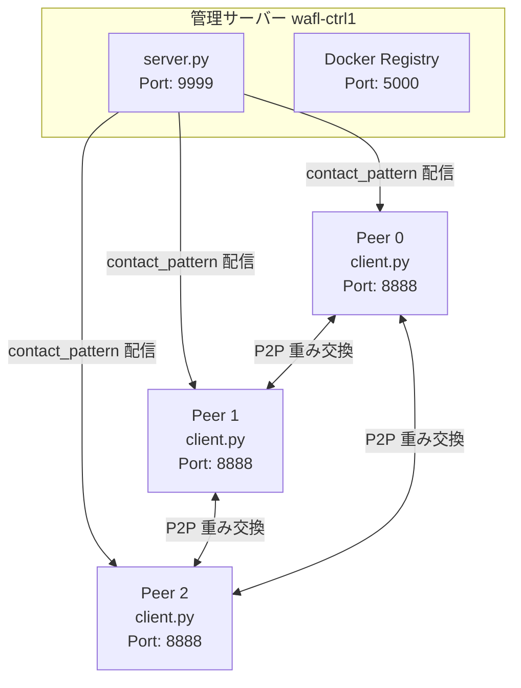
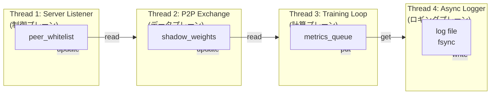
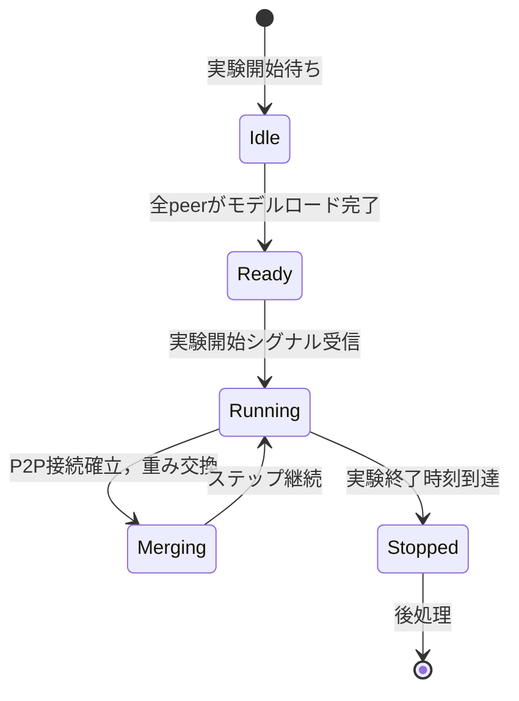
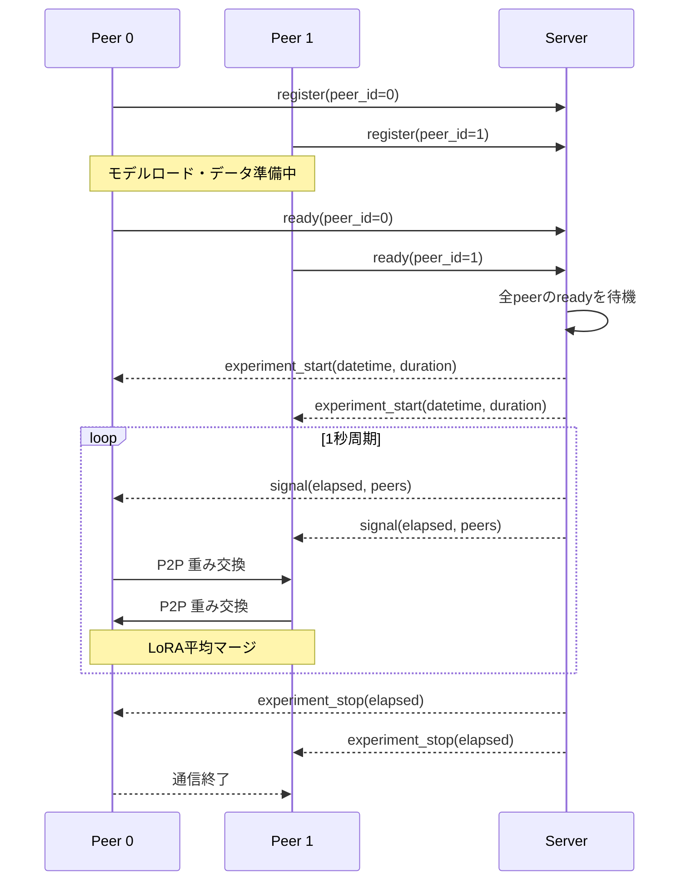
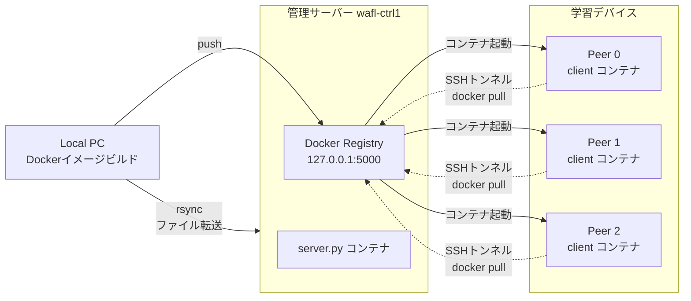

# WAFL-PEFT

WAFL-PEFT は，時変 P2P (Peer-to-Peer) トポロジー下でのフェデレーテッド PEFT (Parameter-Efficient Fine-Tuning) 実験フレームワークである．複数の学習デバイス (peer) が直接重みを交換しながら大規模言語モデルを LoRA で協調学習し，管理サーバーが動的な接触パターン (contact pattern) に応じて通信トポロジーを制御する．

## 技術スタック

| 分野           | 技術                                             |
| -------------- | ------------------------------------------------ |
| フレームワーク | Python 3.10+, PyTorch, transformers, peft (LoRA) |
| データセット   | GSM8K (小学レベル数学文章題)                     |
| コンテナ       | Docker (CUDA 12.8 版 PyTorch，QLoRA 4-bit 量子化) |
| デプロイ       | SSH + rsync + Docker Registry (階層的配布)       |
| 環境管理       | uv (Python), mise (タスクランナー)               |

## 理論的背景

### フェデレーテッド学習

フェデレーテッド学習 (Federated Learning, FL) は，データプライバシーを維持しながら分散環境でモデルを訓練するパラダイムである．中央サーバーがモデルパラメータを配布し，各クライアントがローカルデータで訓練した後に重みを集約する (FedAvg: McMahan et al., 2017) ．

標準的な FL では，すべてのクライアントがサーバーに接続するスター型トポロジーが仮定される．しかしこれは以下の課題を抱える．

- **スケーラビリティ**: クライアント数が増えるとサーバーの通信ボトルネックが顕著になる
- **単一障害点**: サーバーが停止すると全体が停止する
- **ネットワーク制約**: リモート環境ではサーバーとの安定した接続が保証されない

WAFL-PEFT はこの制約を取り除くため，**P2P トポロジー** を採用する． peer は直接重みを交換し，管理サーバーはトポロジー制御のみを行う．

### パラメータ効率的ファインチューニング (PEFT)

大規模言語モデル (LLM) のファインチューニングには数十億のパラメータを更新する必要があり，各 peer が全パラメータを保存・送信するにはメモリと帯域の両面で現実的ではない．

LoRA (Low-Rank Adaptation: Hu et al., 2021) は，凍結された事前学習済みモデルの重み $W_0$ に対して，低ランク分解された更新 $\Delta W = BA$ を追加する．ここで $B \in \mathbb{R}^{d \times r}$, $A \in \mathbb{R}^{r \times k}$ であり，ランク $r \ll \min(d, k)$ である．

$$W_0x + \Delta Wx = W_0x + BAx$$

この方法により，更新対象パラメータが元のモデルの $0.01\%$ 以下に削減され，メモリと通信コストが劇的に減少する．本フレームワークでは，この LoRA パラメータのみを P2P 間で交換し，事前学習済み重みは各 peer がローカルに保持する．

### Non-IID データ分布の課題

現実の分散システムでは，各ノードが同じ確率分布からデータを取得するとは限らない．これを Non-IID (Non-Independent and Identically Distributed) 問題と呼ぶ．

本フレームワークでは， GSM8K の問題をカテゴリ (加減算，乗除算，百分率，平均，混合) に分類し，各 peer を特定のカテゴリに専門化させる．このとき，データは以下のように分散される．

- 70 〜 90%: 専門カテゴリの peer へ (確率的分配)
- 10 〜 30%: ランダム peer へ (マルチホップ用)

Non-IID 分布下では，各 peer のローカル訓練が異なる最適解に向かい，グローバルモデルの収束が不安定になる． P2P 重み交換と時変トポロジーは，この課題に対処するためのメカニズムである．

### 時変トポロジー

本フレームワークの核心概念である．固定トポロジーでは，接続されていない peer 間は知識が伝わらない．時変トポロジーでは，時間とともに通信ペアが変化する．

$t$ 時刻における peer $i$ の通信相手集合を $N_i(t)$ と表す． contact_pattern.json は，離散時刻 $t_1, t_2, \ldots$ における $N_i(t_j)$ を定義する．各接続の開始・終了は， start/end イベントとして明示的に定義される．

この設計により，すべての peer 対が最終的に通信する (グラフが時間的に連結) ，かつ，一度にすべての peer 対が通信するわけではないため，通信衝突を回避できる．

## アーキテクチャ

システム全体は管理サーバーと複数 peer で構成される．



### 5 層スレッドアーキテクチャ (クライアント)

各クライアントは 5 スレッドで並列動作する．この設計の目的は，**計算と通信の完全なオーバーラップ** を実現することである．

| Thread                    | 責務                                                                                    | データフロー     |
| ------------------------- | --------------------------------------------------------------------------------------- | ---------------- |
| Thread 1: Server Listener | 管理サーバーとの永続 TCP 接続．シグナル (ホワイトリスト，実験開始 / 終了) を受信        | 制御プレーン     |
| Thread 2: P2P Exchange    | ホワイトリストに基づき peer へ接続・失効時に切断， LoRA 重みを送受信・平均マージ計算 (model への反映は Thread 3 が行う) | データプレーン   |
| Thread 3: Training Loop   | LoRA パラメータの順伝播・逆伝播・ optimizer.step ．各ステップでメトリクスをキューへ投入 | 計算プレーン     |
| Thread 4: Async Logger    | メトリクスキューから読み取り，ファイルへ非同期書き出し (fsync 付き)                     | ロギングプレーン |
| Thread 5: Async Evaluator | train/test スコアの評価 (`model.generate()`) を Thread 3 から分離して非同期に実行        | 評価プレーン     |

train/test スコア評価 (`model.generate()`) は実測で 10 サンプルの評価に約 87 秒かかる．これを Thread 3 内で直列実行すると訓練が長時間完全停止するストールを引き起こすため，Thread 5 に分離し，訓練と並行して実行する．

スレッド間共有状態は `SharedState` クラスで管理され，ロックとキューで同期する．



#### スレッド同期の詳細

`SharedState` は以下の共有リソースを管理する．

| リソース                 | 型                  | 更新スレッド | 参照スレッド    | 同期機構                   |
| ------------------------ | ------------------- | ------------ | --------------- | -------------------------- |
| `peer_whitelist`         | `set[int]`          | Thread 1     | Thread 2        | `threading.Lock`           |
| `shadow_weights`         | `dict[str, Tensor]` | Thread 3     | Thread 2        | `threading.Lock`           |
| `merge_queue`            | `queue.Queue`       | Thread 2     | Thread 3        | FIFO キュー (maxsize=32)   |
| `eval_request_queue`     | `queue.Queue`       | Thread 3     | Thread 5        | キュー (maxsize=1，最新のみ保持) |
| `metrics_queue`          | `queue.Queue`       | Thread 3, 5  | Thread 4        | FIFO キュー (maxsize=8192) |
| `current_step`           | `int`               | Thread 3     | Thread 2        | `threading.Lock`           |
| `experiment_running`     | `threading.Event`   | Thread 1     | Thread 3, 5      | Event フラグ               |

`peer_whitelist` は現在接触中の peer_id の集合を保持する． Thread 1 がサーバーから受信した `start`/`end` イベントに応じて要素を追加・削除し， Thread 2 がこの集合に基づいて TCP 接続を確立・切断することで，時変トポロジーのローテーションを実際の接続状態に反映する．接触の終了は，残り時間の推定によってではなく，必ずサーバーからの明示的な `end` イベントによってのみ判定される．

#### スループット平坦性 (Stall-Free Design)

伝統的なフェデレーテッド学習では，重み同期のたびに訓練が停止する (synchronize-and-wait) ．これによりスループットが周期性を持ち，時間とスループットの相関が強く現れる．

本フレームワークでは，以下の設計によりこれを回避する．

1. **非同期マージ**: P2P 交換スレッドは訓練ループとは独立に動作し，受信した重みの平均マージ計算のみを行って `merge_queue` に渡す．計算結果をモデル本体へ反映するのは常に訓練ループ (Thread 3) であり，`optimizer.step()` 完了直後のステップ境界でのみ行う．これにより，順伝播・逆伝播の実行中に別スレッドがモデルパラメータを書き換えるデータ競合を構造的に防ぐ
2. **シャドウコピー**: LoRA 重みのコピーを CPU 上に保持し， GPU 訓練とは独立に読み書きできる
3. **マージタイミングの分離**: マージ結果の反映は `current_step` の変化を検知して実行され，訓練ループはブロックされない

この結果，通信中でも計算は継続し，スループットと時間の相関係数は ~0 に近づく．

## プロジェクト構成

```mermaid
graph LR
    subgraph cfg["config/"]
        S["settings.json<br/>実験設定・contact_pattern_file指定"]
        H["hosts.txt<br/>IPリスト"]
    end

    subgraph src["src/"]
        SV["server.py<br/>管理サーバー"]
        CL["client.py<br/>学習クライアント"]
        SD["setup_data.py<br/>データ準備"]
        GC["generate_contact_pattern.py<br/>接触パターン生成"]
        AN["analyze.py<br/>分析・可視化"]
        GEV["gsm8k_eval.py<br/>GSM8K評価ロジック共通モジュール"]
        DD["deploy_distribute.py<br/>デプロイ"]
        SC["start_clients.py<br/>並列起動"]
        CLG["collect_logs.py<br/>ログ回収"]
        CN["clean.py<br/>クリーンアップ"]
        UT["utils.py<br/>共通関数"]
    end

    subgraph data["data/"]
        TR["train/ peer_X.json"]
        TE["test/ peer_X.json"]
        CP["contact_pattern/<br/>時変トポロジーJSON"]
    end

    cfg --> src
    src --> data
```



## 時変トポロジー (contact_pattern.json)

`data/contact_pattern/` 配下の JSON ファイルで，時間経過に伴う P2P 接触の開始・終了を定義する．どのファイルを使うかは `config/settings.json` の `experiment.contact_pattern_file` にファイル名で指定する．キーは実験開始からの経過秒数，値はその時刻に発生したイベントのリストである．各イベントは `{"event": "start"|"end", "peers": [i, j]}` の形式で，`peers` は接触が変化する2つの peer_id を昇順で表す．

```jsonc
{
  "60": [
    { "event": "start", "peers": [0, 1] }
  ],
  "90": [
    { "event": "end", "peers": [0, 1] },
    { "event": "start", "peers": [1, 2] }
  ]
}
```

この例では， t=60s で peer 0-1 間の接触が開始し， t=90s で peer 0-1 間の接触が終了すると同時に peer 1-2 間の接触が新たに開始する．

管理サーバー (`server.py`) は，実験開始からの経過時間に応じて，まだ配信していない新規イベントのみを毎秒クライアントへ配信する．各クライアント (`client.py`) は，自身の peer_id が含まれるイベントを受信するたびに， `start` であれば相手 peer をホワイトリストへ追加し， `end` であればホワイトリストから除去する．接触の終了は必ずサーバーからの明示的な `end` イベントによって制御され，接続時間を事前に見積もる仕組みは持たない．

### contact_pattern.json の生成

`src/generate_contact_pattern.py` は， Random Waypoint Mobility (RWP) モデルに従ってノードを移動させ，無線到達距離内に入った区間を接触イベントへ変換して出力する．ノード数は `config/hosts.txt` の行数から自動決定される．

```bash
uv run python src/generate_contact_pattern.py \
  --n-time 5000 --min-speed 1.0 --max-speed 5.0 \
  --radio-range 100 --area-size 500 --pose-time 10 --seed 42

# または mise 経由（引数は "--" の後に渡す）
mise run setup:contact-pattern -- --n-time 5000 --seed 42
```

| オプション | 意味 | デフォルト |
| --- | --- | --- |
| `--n-time` | シミュレーション総ステップ数（=総秒数） | 5000 |
| `--min-speed` / `--max-speed` | 移動速度の範囲 | 1.0 / 5.0 |
| `--radio-range` | 無線到達距離 | 100 |
| `--area-size` | 正方形エリアの一辺 | 500 |
| `--pose-time` | ウェイポイント到達後の静止時間 | 10 |
| `--seed` | 乱数シード | 42 |
| `--animation` | ノード移動の GIF アニメーションも生成する | 無効 |

出力先は `data/contact_pattern/` 固定であり，ファイル名はパラメータを含む形式 (`rwp_n{ノード数}_a{エリアサイズ}_r{到達距離}_p{静止時間}_s{シード}.json`) になる．生成物を確認した上で，`config/settings.json` の `experiment.contact_pattern_file` にそのファイル名を設定すると `server.py` の起動時に読み込まれる．

### トポロジーのグラフ理論的性質

時変トポロジーは，時間とともに変化するグラフ $G(t) = (V, E(t))$ として定式化できる．ここで $V$ は peer の集合， $E(t)$ は t 時刻の辺の集合である．

本フレームワークが目指す性質は，**時間的連結性 (temporal connectivity)** である．すなわち，任意の peer 対 $(i, j)$ に対して，時間区間 $[0, T]$ の中に $i$ から $j$ への時間依存パスが存在すること．



## GSM8K Non-IID データシャード

`setup_data.py` は GSM8K データセットを peer 固有のシャードに分割する．各 peer が特定のカテゴリ (加減算，乗除算，百分率，平均，混合) に偏ったデータを持つ Non-IID 分布を生成する．

### カテゴリ分類ロジック

問題テキスト内の正規表現キーワードに基づき，最も一致数の多いカテゴリに分類する．

| カテゴリ     | キーワード例                                                                     |
| ------------ | -------------------------------------------------------------------------------- |
| `add_sub`    | total, more, less, left, added, sum, increase, decrease, difference, plus, minus |
| `mul_div`    | times, product, multipl, each, split, divide, per, rate, x\d+                    |
| `percentage` | \d+%, percent, discount, interest, tax                                           |
| `average`    | average, mean, median, per capita                                                |
| `mixed`      | 上記いずれにも該当しない                                                         |

### データ分配アルゴリズム

```
1. GSM8K データセットをシャッフル後，train/test に分割 (設定比率，デフォルト 90/10)
2. 訓練データ各サンプルにカテゴリラベルを付与 (classify_problem関数)
3. カテゴリごとにサンプルをシャッフル
4. peer_id i にカテゴリ categories[i % num_categories] を割り当て
5. 各サンプルを以下のように分配:
   - 確率 p = 0.7 + 0.2 * U(0,1) で専門 peer へ
   - それ以外: ランダム peer へ (マルチホップ用)
6. テストデータは peer_id = idx % num_peers で均等分配
```

この結果，各 peer は自分の専門カテゴリのデータを主に持ちつつ，他のカテゴリのデータも一部持つ．これにより， P2P 交換を通じて他カテゴリの知識も獲得できる．

## 通信プロトコル

### 共通フォーマット

すべてのメッセージは以下のフレーム構造を持つ．

```
+------------------+-------------------+
| Length (4 bytes) | Payload (variable)|
|  (big-endian)    |   (JSON or binary)|
+------------------+-------------------+
```

Length は big-endian 4 バイト符号なし整数． JSON ペイロードは 10MB まで受信する．バイナリペイロードは 100MB まで受信する．

### 管理サーバー <-> クライアント (制御プレーン)

TCP 接続， JSON ボディのフォーマット． `type` フィールドでメッセージ種別を区別する．

| メッセージ         | 方向            | 内容                                                               |
| ------------------ | --------------- | ------------------------------------------------------------------ |
| `register`         | Client → Server | `{"type": "register", "peer_id": int}`                             |
| `ready`            | Client → Server | `{"type": "ready", "peer_id": int}`                                |
| `signal`           | Server → Client | `{"type": "signal", "elapsed": float, "peers": {...}}`             |
| `experiment_start` | Server → Client | `{"type": "experiment_start", "datetime": str, "duration": float}` |
| `experiment_stop`  | Server → Client | `{"type": "experiment_stop", "elapsed": float}`                    |

### P2P 重み交換 (データプレーン)

TCP 接続，以下の順序で送信する．

```
1. peer_id フレーム: 4 バイト長さ + JSON ({"peer_id": int})
2. 重みフレーム (複数可能): 4 バイト長さ + pickle (gzip 圧縮なし)
```

重みデータは LoRA パラメータの state_dict であり，以下の手順で送信用に変換する．

1. 訓練時は数値安定性のため float32 で保持している各テンソルを float16 へダウンキャスト（通信量を約半分に削減．実測で 410 テンソル・約 96.6MB → 約 48MB）
2. `torch.save(state_dict, buffer)` で pickle シリアライズ

gzip 圧縮は行わない．ニューラルネットの重みは乱数に近い分布のため圧縮率が低く（float32・96MB の実測で圧縮後 88.6MB と 8% 程度の削減），圧縮・解凍自体に数秒（実測: 圧縮 6.3 秒，解凍 1.1 秒）かかる．この間 Thread 3 (訓練ループ) との GIL 競合でスループットが周期的に停止するストールを引き起こすため，圧縮による通信量削減よりも計算のブロッキングを避けることを優先する．

受信時は逆の手順で復元し，平均マージする．平均マージは単純算術平均であり， peer $i$ の重み $w_i$ に対して，受信した $K$ peer の重みを以下で統合する．

$$w_{\text{merged}} = \frac{1}{K} \sum_{i=1}^{K} w_i$$

### 実験ライフサイクル



実験の終了は学習ステップ数の上限ではなく，時間のみで制御される．管理サーバーは `contact_pattern.json` のタイムライン上で最後に発生するイベント時刻に固定バッファ (60秒) を加えた時刻を `experiment_duration` として算出し，この時間が経過すると全クライアントへ `experiment_stop` を送信する．クライアントは訓練データを何周でも回し続けながら学習を継続し，`experiment_stop` を受信するまで停止しない．そのため接触パターンの総時間を変更すれば，学習ステップ数の設定を変えることなく実験時間を調整できる．

## 設定 (settings.json)

```jsonc
{
  "model": {
    "model_id": "google/gemma-4-E2B"       // 学習対象モデル
  },
  "training": {
    "learning_rate": 1e-4,                  // AdamW学習率
    "batch_size": 1,                        // バッチサイズ
    "max_seq_len": 320,                     // 最大シーケンス長（vocab_sizeが262144と大きく、大きすぎるとlogitsのメモリ使用量でOOMするため注意）
    "lora_rank": 16,                        // LoRAランク
    "lora_alpha": 32,                       // LoRAアルファ
    "eval_interval_seconds": 60             // train/testスコア評価・チェックポイント保存の間隔（秒）
  },
  "data": {
    "validation_split": 0.1,                // 訓練/テスト分割比率
    "seed": 42                              // 乱数シード
  },
  "communication": {
    "client_p2p_port": 8888                 // P2P通信ポート
  },
  "server": {
    "server_host": "wafl-ctrl1",            // 管理サーバーホスト
    "server_ip": "192.168.11.10",           // 管理サーバーIP
    "server_port": 9999,                    // 管理サーバーポート
    "ufw_allow_from": "192.168.11.0/24,192.168.12.0/24"
  },
  "deployment": {
    "ssh_user": "denjo",                    // SSHユーザー
    "deploy_dir": "/home/denjo/workspace/ktakahashi/WAFL-PEFT"
  },
  "experiment": {
    "experiment_name": "default",            // 実験名
    "contact_pattern_file": "rwp_n05_a0500_r100_p10_s42.json"  // 使用する接触パターンJSON
  }
}
```

### LoRA パラメータの詳細

`lora_rank` と `lora_alpha` は LoRA の内部次元とスケーリング係数を指定する． LoRA の実際の更新は以下のように計算される．

$$\Delta W = \frac{\alpha}{r} BA$$

ここで $\frac{\alpha}{r}$ はスケーリング係数であり，デフォルトでは $\frac{32}{16} = 2.0$ である． rank が小さいほどパラメータ数が削減されるが，表現力が低下する． alpha は rank に対する相対的な重みを調整する．

target_modules は正規表現で指定され，以下のモジュールが対象となる．

```
self_attn.q_proj, self_attn.k_proj, self_attn.v_proj, self_attn.o_proj
mlp.gate_proj, mlp.up_proj, mlp.down_proj
```

## 使用方法

### 1. 環境セットアップ

```bash
# すべて (モデル・データ・Dockerイメージ)
mise run setup

# または個別に実行
mise run setup:model             # HuggingFaceベースモデルをローカルキャッシュへダウンロード
mise run setup:data              # GSM8KをNon-IIDシャードとして生成
mise run setup:build             # Dockerイメージビルド

# 接触パターンの生成（任意，パラメータ変更時のみ実行。setup全体には含まれない）
mise run setup:contact-pattern -- --n-time 5000 --seed 42
```

### 2. デプロイ

```bash
# すべて (ローカル → 管理サーバー → 各学習デバイス)
mise run deploy

# 個別フェーズ
mise run deploy:sync-local    # 管理サーバーへファイル転送
mise run deploy:registry      # 管理サーバーのレジストリへイメージpush
mise run deploy:distribute    # 各学習デバイスへイメージ配布・コンテナ起動
```

デプロイフローは以下の 3 層階層である．



### 3. 実験実行

```bash
# すべて (サーバー + 全クライアント起動)
mise run start

# 個別
mise run start:server    # 管理サーバーコンテナ起動（グローバル収束性能のリアルタイム評価スレッドを含む）
mise run start:clients   # 全学習デバイスコンテナ並列起動
```

### 4. 分析

```bash
# すべて (ログ回収 + 評価)
mise run analyze

# 個別
mise run analyze:collect     # 各デバイスからメトリクス・LoRA重みを回収
mise run analyze:evaluate    # マージ・グラフ生成・レポート作成
```

### 5. クリーンアップ

```bash
mise run clean
```

ローカル (cache/, .venv/, data/) ，管理サーバー，全学習デバイス上の Docker コンテナ・イメージ・デプロイディレクトリを削除する．

## グローバルモデルのリアルタイム監視 (server.py の GlobalEval スレッド)

`mise run analyze` は実験終了後にしか収束性能を評価できないため，学習中に
フェデレーテッド学習全体としての収束傾向を追跡できるよう，`server.py` は
実験管理と並行して GlobalEval スレッド（`_global_eval_thread`）を実行する．
`config/settings.json` の `global_eval.interval_seconds`（デフォルト 120 秒）
ごとに以下を行う．

1. 各学習デバイスから最新の LoRA 重みチェックポイントを SSH + rsync で収集
2. 収集した中で最新のステップ番号のチェックポイントを全 peer 間で平均マージ
3. GSM8K バリデーションセット（`global_eval.sample_limit` 件，デフォルト 20）で
   マージ後のグローバルモデルの accuracy を評価
4. 結果を `results/{experiment_name}_{timestamp}/global_eval.log` に
   JSON Lines 形式（`{"step": int, "timestamp": str, "accuracy": float, "num_devices": int}`）で追記

評価ロジックは `analyze.py` の収束性能評価（評価 5）と共通のモジュール
`gsm8k_eval.py` を利用しており，両者で評価条件（LoRA 設定・生成パラメータ）
が一致する．学習用の GPU（各学習デバイス）とは別に，管理サーバー自身の GPU
を使うため，学習スループットへの影響がない．そのため `start:server` タスクの
コンテナ起動には `--gpus all` と各学習デバイスへ接続するための SSH 鍵の
読み取り専用マウント（`-v /home/{ssh_user}/.ssh:/home/{ssh_user}/.ssh:ro`）が
追加されている．

## 実験結果分析 (analyze.py)

`analyze.py` は以下の 5 つの評価グラフを生成する．

### 評価 1: スループットの平坦性 (Stall-Free Demonstration)

通信中でも計算が停止しないことを実時間軸で示す．各 peer の Token/s をプロットし，平均 (時間ビン分割) と標準偏差範囲を描画する．相関係数 ~0 が stall-free の指標である．

時間ビン数は 50 に固定し，各ビン内で全 peer の測定値を平均・標準偏差計算する．相関係数はピアソン相関係数を用い， elapsed time と tokens_per_sec の線形関連性を定量する．

### 評価 2: 損失関数の推移

各 peer の訓練損失を時間軸でプロットする．赤線はビン平均， shaded area は 1 標準偏差．

### 評価 3: loss vs throughput 散布図

各データポイントを peer ID で色分けし，スループットと損失の関係を可視化する．

### 評価 4: train/test スコア推移

各 peer の訓練精度・テスト精度を時間軸でプロットする．過学習の有無を同時に確認できる．

### 評価 5: 知識収束 (Convergence under Time-Varying Topology)

回収した LoRA 重みチェックポイントを GSM8K バリデーションセットで評価し，ステップ wise の accuracy 推移を描画する．中央集約学習の上限 (推定) と既存のラウンド制フェデレーテッド学習 (推定) と比較する．デフォルトで実行され，環境変数 `ANALYZE_CONVERGENCE=0` を設定するとスキップできる．

評価手順は以下の通り．

1. 各チェックポイント `weights_step_XXXXXX.pt` をロード
2. GSM8K テストセットから最大 20 件サンプリング
3. 各問題に対して `Question: {question}\nAnswer:` を入力とし，最大 64 トークン生成
4. 生成テキストに正解数値 (`#### ` 以降) が含まれるかを判定
5. accuracy = 正解数 / 処理件数

生成されたレポートは `results/{experiment_name}_{timestamp}/output/analysis_report.md` に保存される．

## Docker コンテナ構成

各コンテナは以下のボリュームをマウントする．

| マウント元 | マウント先  | 用途                                |
| ---------- | ----------- | ----------------------------------- |
| ./src      | /app/src    | ソースコード                        |
| ./config   | /app/config | 設定ファイル                        |
| ./data     | /app/data   | 訓練・テストデータ                  |
| ./cache    | /app/cache  | モデルキャッシュ (クライアントのみ) |
| ./logs     | /app/logs   | メトリクスログ，チェックポイント    |

管理サーバー・学習デバイスの両方が `--net=host` モードで起動する．学習デバイス側の P2P 用ポート（`client_p2p_port`）はこのモードでなければホストに公開されず，他 peer から一切接続できなくなるため必須である．学習デバイスは加えて `--add-host wafl-ctrl1:{server_ip}` で管理サーバーの IP を追加設定する．

### Dockerfile のビルド順序

Dockerfile はビルドレイヤーの最適化を考慮している．変更頻度の低い層を先にビルドし，キャッシュを最大化する．

1. システム依存 (curl, rsync, openssh-client) — ほぼ不変
2. uv インストール — 不変
3. ユーザー作成 — 不変
4. pyproject.toml コピー + 依存関係インストール（`--mount=type=cache` でuv/pipの
   ダウンロードキャッシュを永続化．レイヤー1のようなシステム依存を変更して
   これより上流のレイヤーキャッシュが無効になった場合でも，torch 等の
   巨大パッケージ（合計10GB超）の再ダウンロードを避けられる）— 稀に変更
5. 仮想環境 (.venv) の chown — この時点では src/・config/ がまだCOPYされて
   いないため，chown -R の対象が .venv のみに確定する
6. ソースコードコピー（`COPY --chown` で直接所有権を指定）— 頻繁に変更．
   レイヤー5を分離しているため，ソース変更のみのリビルドで
   chown -R の再実行（.venv 全体，数百秒）が発生しない
7. Docker 設定 (insecure-registries) — 不変

## ネットワークポート

| ポート | 用途                           | 開放先                            |
| ------ | ------------------------------ | --------------------------------- |
| 9999   | 管理サーバー <-> クライアント  | 192.168.11.0/24, 192.168.12.0/24  |
| 8888   | クライアント間 P2P 重み交換    | 192.168.11.0/24, 192.168.12.0/24  |
| 5000   | Docker Registry (管理サーバー) | localhost のみ (SSH トンネル経由) |

デプロイ時に `ufw_allow_from` に基づき自動で firewall ルールが設定される． 0.0.0.0 への全開放は行わず，指定サブネットからのみ許可する．

## メトリクスログフォーマット

各 peer の `logs/metrics_peer_{ID}_final.log` には， 1 行 1JSON で以下のフィールドを記録する．

| フィールド        | 型            | 説明                                                        |
| ----------------- | ------------- | ----------------------------------------------------------- |
| peer_id           | int           | ペア識別子                                                   |
| step              | int           | 訓練ステップ番号（"metric" / "checkpoint" のみ）             |
| elapsed           | float         | 実験開始からの経過秒数                                       |
| loss              | float         | 訓練損失（"metric" / "checkpoint" のみ）                     |
| tokens_per_sec    | float         | スループット（"metric" / "checkpoint" のみ）                 |
| total_tokens      | int           | 累積トークン数（"metric" / "checkpoint" のみ）                |
| step_duration     | float         | ステップ全体の実行時間（"metric" / "checkpoint" のみ）        |
| compute_duration  | float         | forward/backward/optimizer.step の純計算時間                |
| stall_duration     | float         | step_duration - compute_duration （マージ反映・GPU解放・評価等のオーバーヘッド。Computation Stall 指標） |
| gpu_util_percent  | float \| null | GPU SM 使用率 (%) ． CPU 環境では null                        |
| train_score       | float         | 訓練 accuracy (%) ，"eval" タイプのみ (それ以外は常に 0.0)     |
| test_score        | float         | テスト accuracy (%) ，"eval" タイプのみ (それ以外は常に 0.0)   |
| allowed_peers     | list[int]     | 接触可能peer一覧（"contact_event" のみ）                      |
| type              | string        | "metric" ・ "checkpoint" ・ "contact_event" ・ "eval" のいずれか |

"contact_event" は Thread 1 がサーバーからの signal で許可 peer リストが変化した瞬間にのみ記録され，`contact_pattern.json` の意図した切り替え時刻と実際の接続状態がずれていないかを事後検証できる．

"eval" は Thread 5 (非同期評価スレッド) が train/test スコアを計算し終えた時点で記録される．Thread 3 (訓練ループ) とは非同期に実行されるため，`step` は評価をリクエストした時点のステップ番号であり，実際に評価対象とした重みの厳密なスナップショットとは限らない（進捗モニタリング目的のため許容している）．

ログファイルは各 peer ごとに独立して作成され，実験終了後に `_final` サフィックス付きのリネームで確定する．書き出し時には `fsync` を呼び出し，データ損失を防止する．
